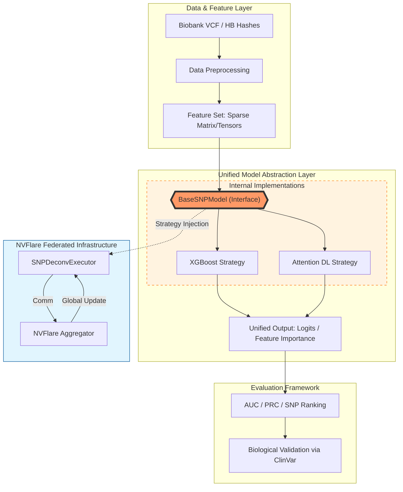
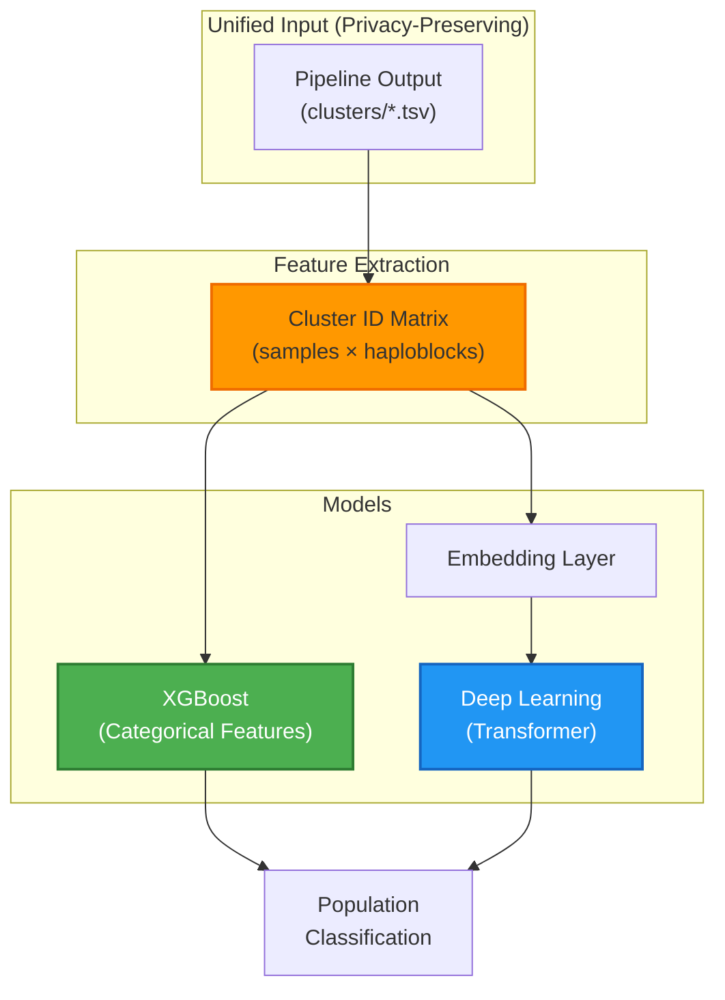
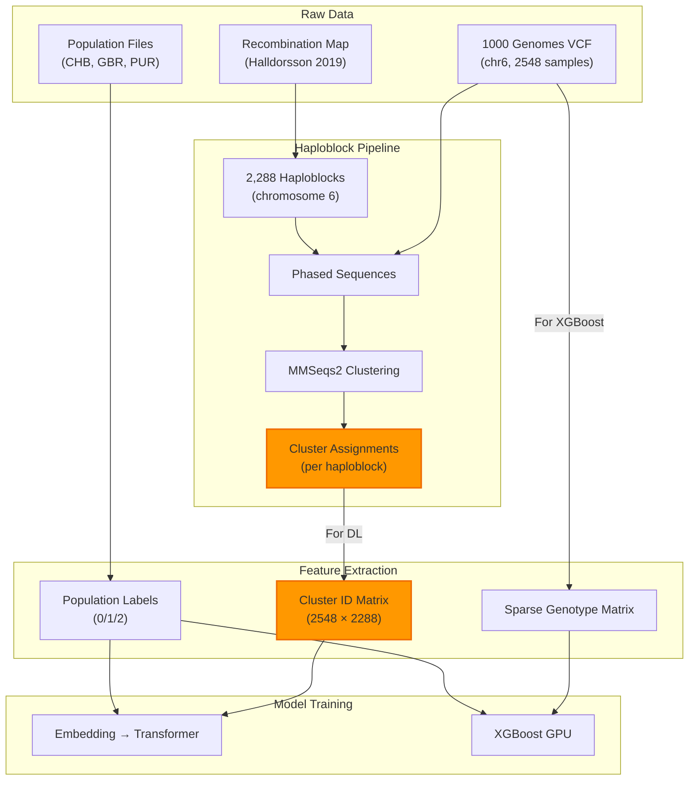

# SNP Deconvolution

**Privacy-preserving population classification using recombination-defined genomic hashes and federated learning.**

## Overview

This project provides an end-to-end pipeline for:

1. **Haploblock Clustering** - Generate recombination-defined genomic hashes from phased VCF data
2. **SNP Deconvolution** - GPU-accelerated machine learning for population classification
3. **Federated Learning** - NVFlare integration for multi-site privacy-preserving training



## Project Structure

```
Haploblock_Clusters_ElixirBH25/
│
├── haploblock_pipeline/          # Phase 1: Haploblock Clustering
│   ├── step1_haploblocks.py      # Define haploblock boundaries
│   ├── step2_phased_sequences.py # Extract phased sequences
│   ├── step3_merge_fasta.py      # Merge sequences
│   ├── step4_clusters.py         # MMSeqs2 clustering
│   └── step5_variant_hashes.py   # Generate genomic hashes
│
├── snp_deconvolution/            # Phase 2: ML/DL Classification
│   ├── data_integration/         # Data loading
│   │   ├── cluster_feature_loader.py  # Cluster IDs → Embedding
│   │   └── sparse_genotype_matrix.py  # VCF → Sparse matrix
│   ├── xgboost/                  # XGBoost GPU
│   │   ├── xgb_trainer.py        # GPU histogram training
│   │   └── feature_selector.py   # Iterative SNP selection
│   ├── attention_dl/             # Deep Learning
│   │   ├── lightning_trainer.py  # PyTorch Lightning
│   │   └── nvflare_lightning.py  # NVFlare integration
│   └── nvflare_base/             # Federated Learning
│       ├── base_executor.py      # Abstract executor
│       └── *_nvflare_wrapper.py  # Model wrappers
│
├── dl_models/                    # Model Architectures
│   ├── haploblock_embedding_model.py  # Embedding + Transformer
│   └── snp_interpretable_models.py    # CNN/Transformer
│
└── data/                         # Input Data
    ├── *.vcf.gz                  # 1000 Genomes VCF
    └── igsr-*.tsv                # Population labels
```

## Core Concept: Genomic Hashes

The pipeline generates **unique genomic identifiers** that encode:

```
individual_hash = strand(4) + chromosome(10) + haploblock(20) + cluster(20) + [variants]
```

| Component | Bits | Description |
|-----------|------|-------------|
| Strand | 4 | Haplotype strand (0 or 1) |
| Chromosome | 10 | Chromosome number |
| Haploblock | 20 | Haploblock position index |
| **Cluster** | 20 | **MMSeqs2 cluster membership** |
| Variants | N | Optional SNP-specific encoding |

**Key Insight**: The **Cluster ID** is the meaningful categorical feature for ML/DL!

## Architecture: Unified Privacy-Preserving ML

Both models now support the **privacy-preserving Cluster ID mode** (recommended):



### Feature Modes

| Mode | Privacy | Input | Use Case |
|------|---------|-------|----------|
| **Cluster (default)** | High | Cluster ID matrix | Privacy-preserving federated learning |
| **SNP (baseline)** | Low | Sparse SNP matrix | Baseline comparison |

### Model Comparison

| Aspect | XGBoost GPU | Deep Learning |
|--------|-------------|---------------|
| **Input** | Cluster ID (categorical) | Cluster ID → Embedding |
| **Features** | XGBoost auto-splits | Learned representations |
| **Model** | Gradient boosted trees | CNN + Transformer |
| **Interpretability** | Haploblock importance | Attention weights |
| **Speed** | Fast | Slower |
| **Long-range patterns** | Limited | Captures via Transformer |
| **Best for** | Quick baseline | Complex interactions |
<!-- 
## Quick Start

### 1. Run Haploblock Pipeline

```bash
# Using Docker
docker build -t haploblock-pipeline .
docker run -it --rm -v $(pwd)/data:/app/data haploblock-pipeline

# Inside container
cd haploblock_pipeline
python main.py --config config/default.yaml
```

### 2. Train XGBoost Model

```python
from snp_deconvolution.xgboost import XGBoostSNPTrainer
from snp_deconvolution.data_integration import SparseGenotypeMatrix

# Load data
X = SparseGenotypeMatrix.from_vcf('data/chr6.vcf.gz')
y = ...  # Population labels (0: CHB, 1: GBR, 2: PUR)

# Train
trainer = XGBoostSNPTrainer(
    n_estimators=2000,
    max_depth=6,
    gpu_id=0,
    num_class=3
)
trainer.fit(X.matrix, y, X_val, y_val)

# Get important SNPs
importance = trainer.get_feature_importance(top_k=100)
```

### 3. Train Deep Learning Model

```python
from snp_deconvolution.data_integration import ClusterFeatureLoader
from dl_models.haploblock_embedding_model import HaploblockTransformer
import pytorch_lightning as pl

# Load cluster IDs (not raw hashes!)
loader = ClusterFeatureLoader('out_dir/TNFa')
dataset = loader.prepare_dataset([
    'data/igsr-chb.tsv.tsv',
    'data/igsr-gbr.tsv.tsv',
    'data/igsr-pur.tsv.tsv'
])

# Model with embedding layer
model = HaploblockTransformer(
    n_haploblocks=dataset['n_haploblocks'],
    vocab_sizes=dataset['vocab_sizes'],  # Cluster counts per haploblock
    embedding_dim=32,
    transformer_dim=128,
    num_classes=3
)

# Train with Lightning (bf16 automatic on A100/H100)
trainer = pl.Trainer(
    precision='bf16-mixed',
    max_epochs=100,
    accelerator='gpu'
)
trainer.fit(model, train_loader, val_loader)

# Get haploblock importance
importance = model.get_haploblock_importance()
```

### 4. Federated Learning with NVFlare

```python
import nvflare.client.lightning as flare

flare.init()
flare.patch(trainer)

while flare.is_running():
    input_model = flare.receive()
    trainer.fit(model, datamodule=dm)
``` -->

## Data Flow




## Configuration

```yaml
# snp_deconvolution/config/deconv_config.yaml

data:
  pipeline_output_dir: "out_dir/TNFa"
  population_files:
    - "data/igsr-chb.tsv.tsv"  # CHB (label: 0)
    - "data/igsr-gbr.tsv.tsv"  # GBR (label: 1)
    - "data/igsr-pur.tsv.tsv"  # PUR (label: 2)

xgboost:
  n_estimators: 2000
  max_depth: 6
  tree_method: "gpu_hist"

deep_learning:
  architecture: "cnn_transformer"
  lightning:
    precision: "bf16-mixed"
  model:
    embedding_dim: 32
    transformer_dim: 128
    num_heads: 8

nvflare:
  aggregation_strategy: "fedavg"
  num_rounds: 50
```

## Results

Pipeline tested on:
- **Chromosome 6**: 2,288 haploblocks
- **Populations**: CHB (Han Chinese), GBR (British), PUR (Puerto Rican)
- **Samples**: 2,548 individuals from 1000 Genomes Phase 3

## References

1. Halldorsson et al. (2019). Characterizing mutagenic effects of recombination through a sequence-level genetic map. *Science*, 363(6425).

2. Palsson et al. (2025). Complete human recombination maps. *Nature*, 639, 700-707.

3. NVFlare Documentation: https://nvflare.readthedocs.io/

## Acknowledgements

This work was supported by ELIXIR, the research infrastructure for life science data, and conducted at the ELIXIR BioHackathon Europe 2025.

## License

MIT License
