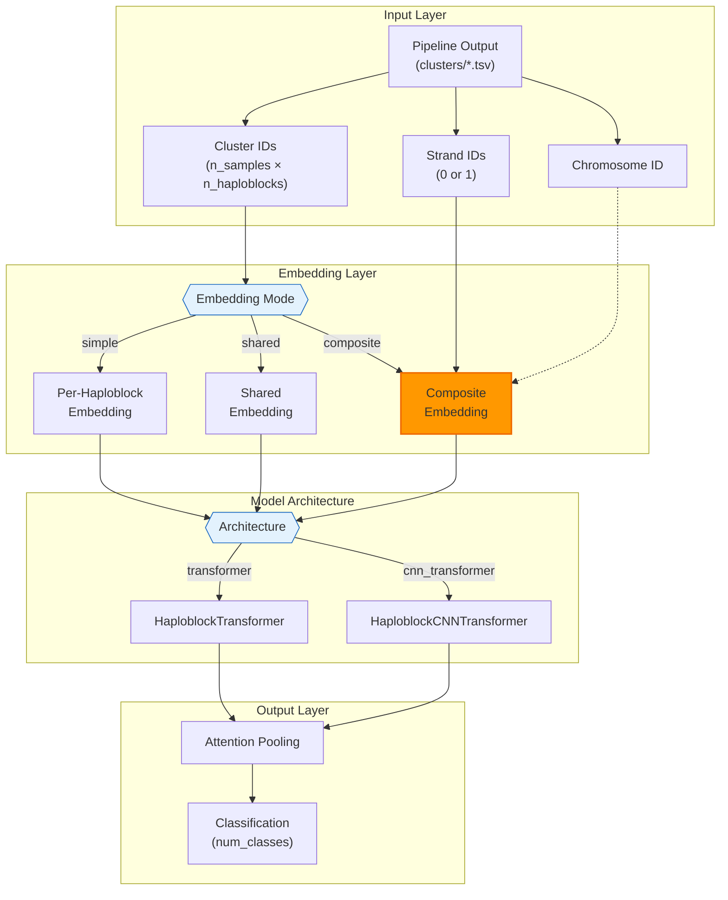
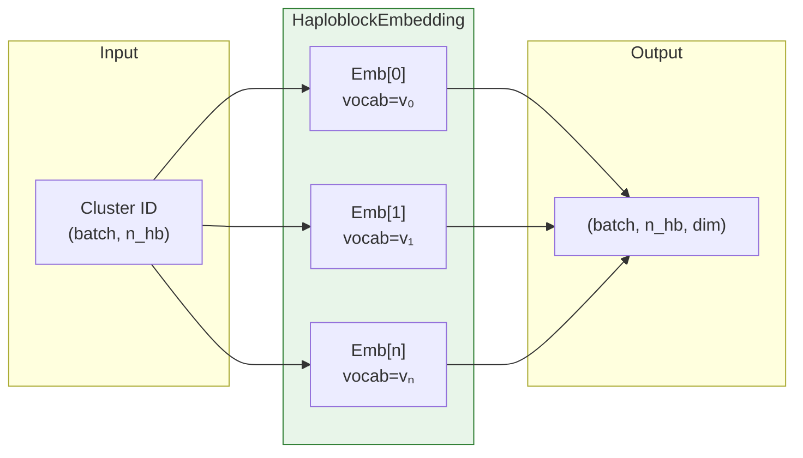
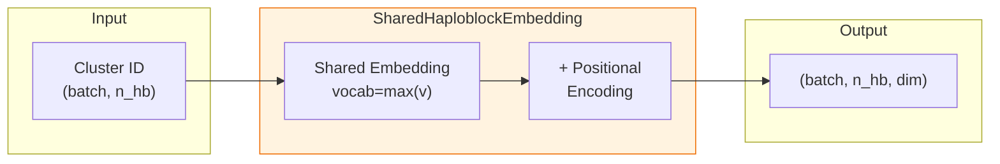
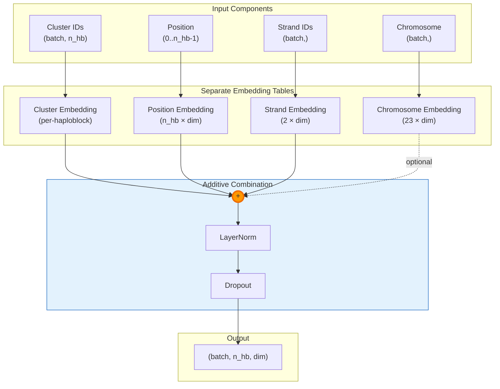
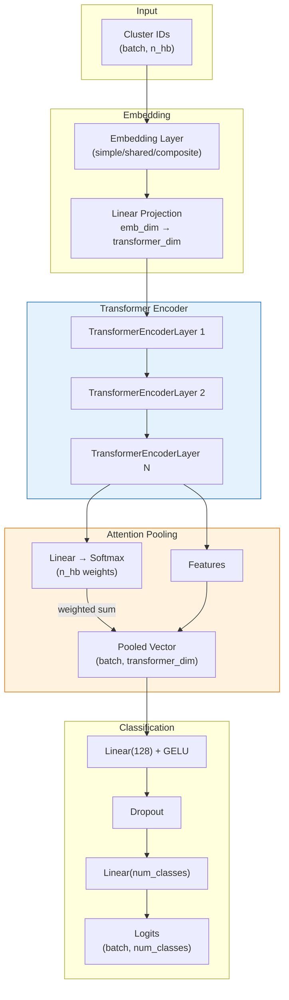
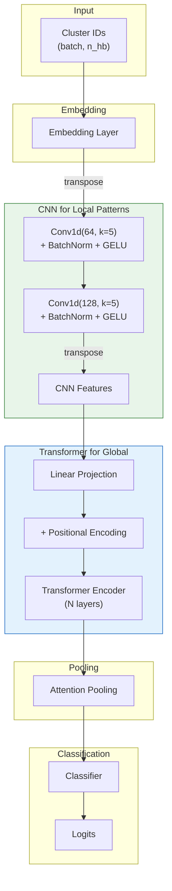
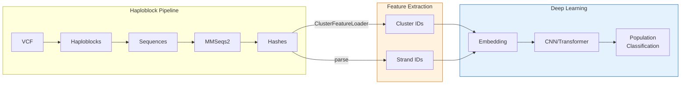

# Deep Learning Model Architecture

## Overview



## Embedding Modes

### 1. Simple Embedding (Per-Haploblock)



- Each haploblock has independent embedding table
- Vocab size varies per haploblock (cluster count)
- Parameters: `Σ(vocab_sizes[i] × embedding_dim)`

### 2. Shared Embedding



- Single embedding table for all haploblocks
- Positional encoding distinguishes positions
- More parameter-efficient

### 3. Composite Embedding (Recommended)



**Key Insight**: Similar to BERT's `token_emb + position_emb + segment_emb`

```
final_embedding = cluster_emb + position_emb + strand_emb [+ chr_emb]
```

## Model Architectures

### HaploblockTransformer



### HaploblockCNNTransformer



## Parameter Comparison

| Model | Embedding | Parameters | Notes |
|-------|-----------|------------|-------|
| HaploblockTransformer | simple | ~1.37M | Per-haploblock embedding |
| HaploblockTransformer | composite | ~1.93M | + strand/position embedding |
| HaploblockCNNTransformer | simple | ~1.85M | + CNN layers |
| HaploblockCNNTransformer | composite | ~2.00M | Full model |

## Usage Examples

### Simple Mode

```python
model = HaploblockTransformer(
    n_haploblocks=2288,
    vocab_sizes=vocab_sizes,
    embedding_dim=32,
    transformer_dim=128,
    num_classes=3,
    embedding_mode='simple'
)

logits = model(cluster_ids)
```

### Composite Mode (Recommended)

```python
model = HaploblockTransformer(
    n_haploblocks=2288,
    vocab_sizes=vocab_sizes,
    embedding_dim=64,
    transformer_dim=128,
    num_classes=3,
    embedding_mode='composite',
    use_strand_embedding=True,
    use_chromosome_embedding=False
)

logits, attention = model(
    cluster_ids,
    strand_ids=strand_ids,
    return_attention=True
)

# Interpretability: attention weights show haploblock importance
important_haploblocks = attention.mean(dim=0).argsort(descending=True)[:10]
```

## Data Flow Summary


