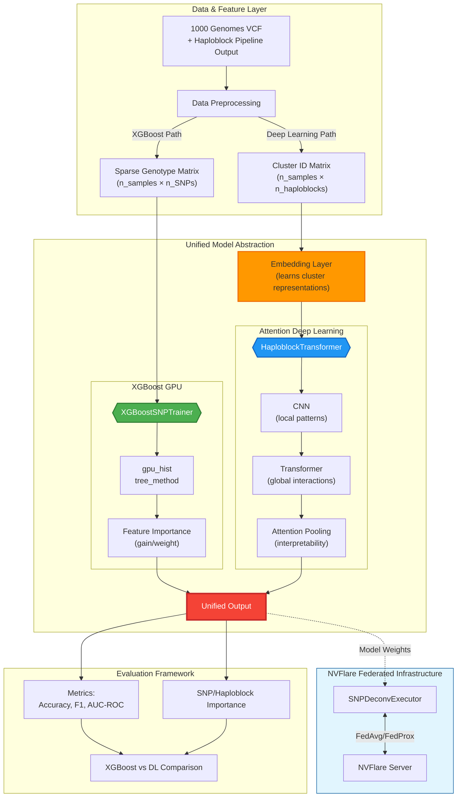
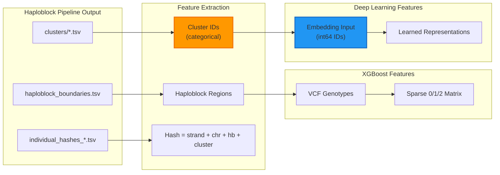

# SNP Deconvolution Module

GPU-accelerated SNP analysis for population classification using haploblock clustering features.

## Architecture Overview



## Data Flow

### Pipeline Output → ML Features



## Two Approaches

### 1. XGBoost GPU (`tree_method='gpu_hist'`)

**Input**: Sparse genotype matrix (SNP 0/1/2 encoding)

```python
from snp_deconvolution.xgboost import XGBoostSNPTrainer

trainer = XGBoostSNPTrainer(
    n_estimators=2000,
    max_depth=6,
    gpu_id=0,
    num_class=3  # CHB, GBR, PUR
)
trainer.fit(X_train_sparse, y_train)

# Feature importance
importance = trainer.get_feature_importance(importance_type='gain', top_k=100)
```

### 2. Attention Deep Learning (PyTorch Lightning + Embedding)

**Input**: Cluster ID matrix (categorical → embedding)

```python
from snp_deconvolution.data_integration import ClusterFeatureLoader
from dl_models.haploblock_embedding_model import HaploblockTransformer

# Load cluster IDs
loader = ClusterFeatureLoader('out_dir/TNFa')
dataset = loader.prepare_dataset(population_files)

# Model with embedding
model = HaploblockTransformer(
    n_haploblocks=dataset['n_haploblocks'],
    vocab_sizes=dataset['vocab_sizes'],  # clusters per haploblock
    embedding_dim=32,
    transformer_dim=128,
    num_classes=3
)

# Lightning training (bf16 automatic)
trainer = pl.Trainer(precision='bf16-mixed', max_epochs=100)
trainer.fit(model, train_loader, val_loader)
```

## Key Insight: Hash Structure

Pipeline generates hashes with structure:
```
individual_hash = strand_hash(4) + chr_hash + haploblock_hash(20) + cluster_hash(20)
```

**The meaningful feature is CLUSTER ID, not the hash string!**

- Each sample belongs to a cluster within each haploblock
- Cluster membership is the discriminative feature for population classification
- Use **Embedding** to learn cluster representations (not raw hash values)

## Module Structure

```
snp_deconvolution/
├── config/
│   └── deconv_config.yaml          # Configuration
│
├── data_integration/               # Data loading
│   ├── cluster_feature_loader.py   # Cluster IDs for DL (recommended)
│   ├── sparse_genotype_matrix.py   # Sparse matrix for XGBoost
│   └── haploblock_loader.py        # General data loader
│
├── xgboost/                        # XGBoost GPU
│   ├── xgb_trainer.py              # XGBoostSNPTrainer
│   └── feature_selector.py         # Iterative feature selection
│
├── attention_dl/                   # Deep Learning
│   ├── lightning_trainer.py        # SNPLightningModule
│   └── nvflare_lightning.py        # NVFlare integration
│
└── nvflare_base/                   # Federated Learning
    ├── base_executor.py            # Abstract executor
    ├── xgb_nvflare_wrapper.py      # XGBoost FL wrapper
    └── dl_nvflare_wrapper.py       # DL FL wrapper
```

## Quick Start

```python
# Option 1: XGBoost (fast, interpretable)
from snp_deconvolution.xgboost import XGBoostSNPTrainer
from snp_deconvolution.data_integration import SparseGenotypeMatrix

X = SparseGenotypeMatrix.from_vcf('data/chr6.vcf.gz')
trainer = XGBoostSNPTrainer(gpu_id=0, num_class=3)
trainer.fit(X.matrix, y)

# Option 2: Deep Learning (embedding-based)
from snp_deconvolution.data_integration import load_cluster_features
from dl_models.haploblock_embedding_model import HaploblockCNNTransformer

dataset = load_cluster_features('out_dir/TNFa', population_files)
model = HaploblockCNNTransformer(
    n_haploblocks=dataset['n_haploblocks'],
    vocab_sizes=dataset['vocab_sizes'],
    num_classes=3
)
```

## Hardware Requirements

| Component | Requirement |
|-----------|-------------|
| GPU | NVIDIA A100/H100 (40GB+) |
| CUDA | 12.x |
| Precision | bf16-mixed (Lightning handles automatically) |

## NVFlare Federated Learning

```python
# Client-side (Lightning integration)
import nvflare.client.lightning as flare

flare.init()
flare.patch(trainer)  # Patch Lightning trainer

while flare.is_running():
    input_model = flare.receive()
    trainer.fit(model, datamodule=dm)
```

## Comparison: XGBoost vs Deep Learning

| Aspect | XGBoost | Deep Learning |
|--------|---------|---------------|
| Input | Sparse SNP matrix | Cluster ID matrix |
| Feature Engineering | Manual (0/1/2 encoding) | Learned (embedding) |
| Interpretability | gain/weight importance | Attention weights |
| Training Speed | Fast | Slower |
| Long-range Patterns | Limited | Transformer captures |
| Best For | Quick baseline, feature selection | Complex interactions |
